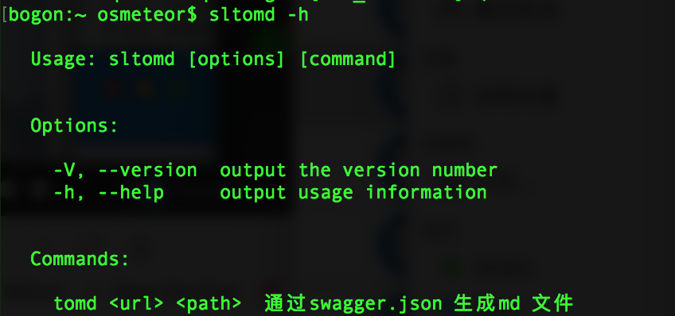
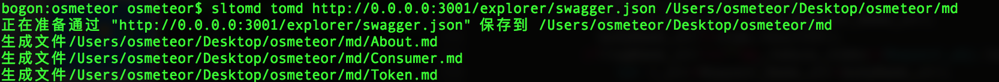
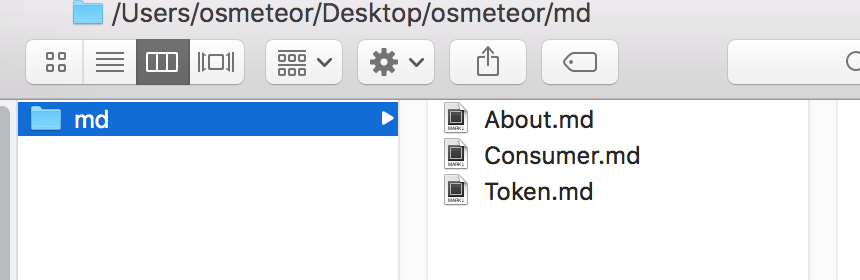

# sltomd
- convert strongloop swagger.json to markdown file

## how to use it
- npm install sltomd -g

```javascript
sltomd tomd tomd http://0.0.0.0:3000/explorer/swagger.json  mypath
```
## snapshot





## other 
	- [https://strongloop.com/](https://strongloop.com/)
	- [https://github.com/OSMeteor/eutil.git](https://github.com/OSMeteor/eutil.git)
	- [https://github.com/strongloop](https://github.com/strongloop)